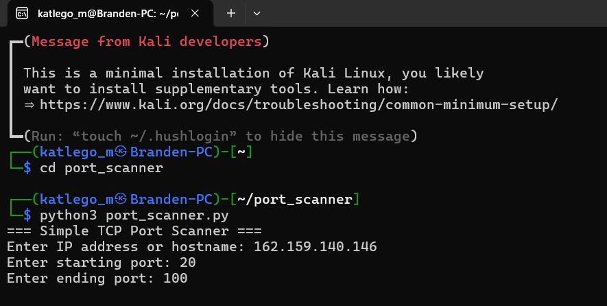
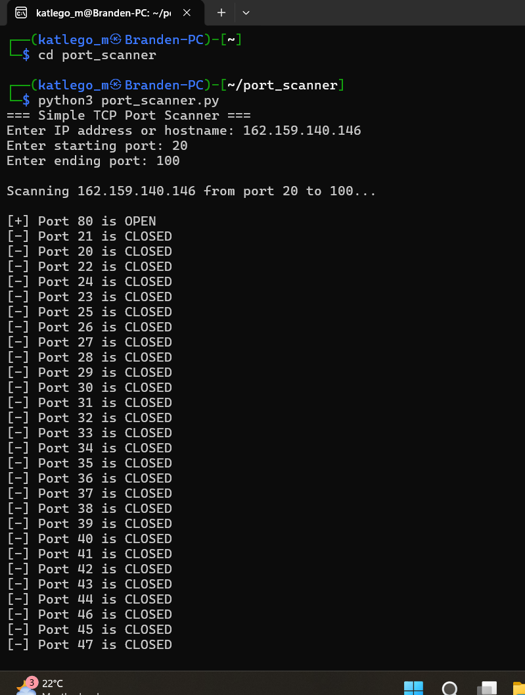

# Python TCP Port Scanner

A beginner-friendly TCP port scanner written in Python and designed to run on Kali Linux.

## Features
- Scans a target host for open TCP ports
- Multi-threaded scanning for faster results
- Beginner-friendly and well-commented code
- Safe for learning and educational use

## Usage
```bash
(1) cd port_scanner
(2) python3 port_scanner.py

## Example
Target: 127.0.0.1
Ports: 20–100

## Disclaimer
This tool is for educational purposes only. Only scan systems you own or have permission to test.
# python-port-scanner

## Screenshots

### Running the Port Scanner


### Entering Target and Port Range


### Scan Results

