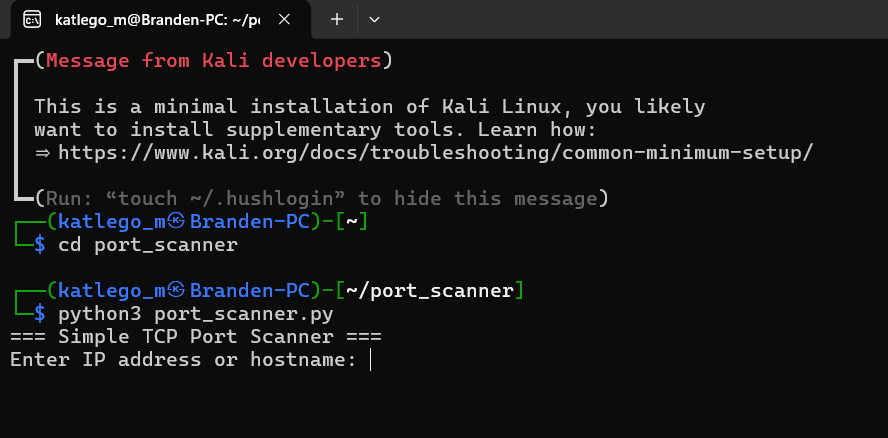

<h1>Python TCP Port Scanner</h1>

A simple TCP port scanner written in Python, developed and tested on
<strong>Kali Linux</strong>.  
This project was created as part of my cybersecurity internship to learn
network scanning, socket programming, and Linux terminal workflows.

<h2>⚠️ Ethical Disclaimer</h2>

This tool is intended for <strong>educational purposes only</strong>.
Only scan systems you own or have explicit permission to test.
Unauthorized scanning is illegal and unethical.

<h2>🛠️ Technologies Used</h2>
<ul>
  <li>Python 3</li>
  <li>Kali Linux</li>
  <li>Socket Programming</li>
  <li>Multithreading</li>
</ul>

<h2>📂 Project Structure</h2>
<pre>
python-port-scanner/
│
├── port_scanner.py
├── README.md
└── screenshots/
    ├── run.png
    ├── input.png
    └── results.png
</pre>

<h2>🚀 How to Run the Port Scanner (Kali Linux)</h2>

<ol>
  <li>Open the terminal</li>
  <li>Navigate to the project folder</li>
</ol>

<pre>
cd python-port-scanner
</pre>

<ol start="3">
  <li>Make the script executable (optional)</li>
</ol>

<pre>
chmod +x port_scanner.py
</pre>

<ol start="4">
  <li>Run the script</li>
</ol>

<pre>
python3 port_scanner.py
</pre>

<h2>📸 Screenshots</h2>

<h3>Running the Port Scanner</h3>

<h3>Entering Target and Port Range</h3>

<h3>Scan Results</h3>

<h2>📚 What I Learned</h2>
<ul>
  <li>How TCP port scanning works</li>
  <li>Python socket programming</li>
  <li>Using threads for faster scans</li>
  <li>Linux terminal and Git workflows</li>
  <li>Ethical considerations in cybersecurity</li>
</ul>

<h2>👤 Author</h2>

<strong>Katlego Motsoaledi</strong> 
Cybersecurity Intern 
GitHub: <a href="https://github.com/Handsomebranden">Handsomebranden</a>

